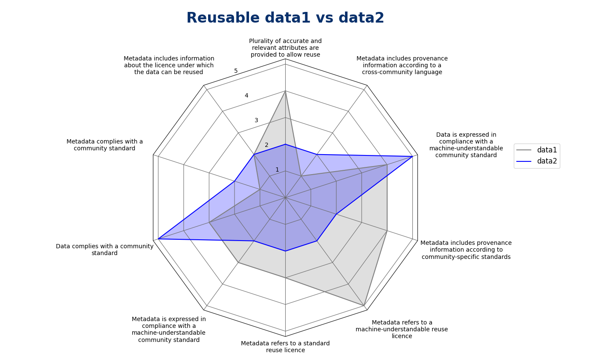
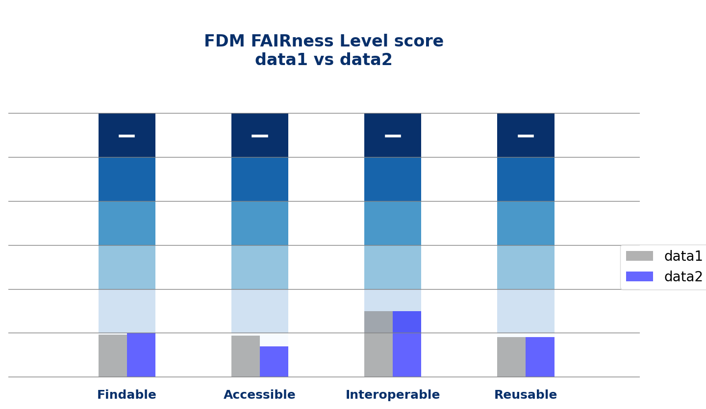

# FAIR Visualization Metrics

Python scripts to visualise the WATERVERSE FAIR Implementation Profile (WFIP) results.


## Overview

This repository offers visualization tools to analyze FAIR levels across different data sources. You can generate:

- **Radar charts** for FAIR analysis (with overlay comparisons)
- **Bar-column charts** showing FAIRness level score (with side-by-side comparisons)
- **Pie charts** showing distribution of priorities

## Example Graphs

<p align="center">
  
  
</p>

---

## 📂 Project Structure

- `figures.py` – Core plotting script
- `requirements.txt` – Dependency definitions
- `test/` – Placeholder for future tests
- `data/` – Directory for input data (JSON)

---

## ⚙️ Setup

Make sure you have **Python 3.11** or newer installed.

Example of how to install the required dependencies:

```bash
python -m venv myenv
source myenv/bin/activate               # Linux/macOS
pip install -r requirements.txt
```

## 📊 Visualizing Metrics

Move the data to `data/` directory and modify the json file names in `figures.py` to work on desired data.
Then simply run the script to generate plots:

```bash
python figures.py
```


